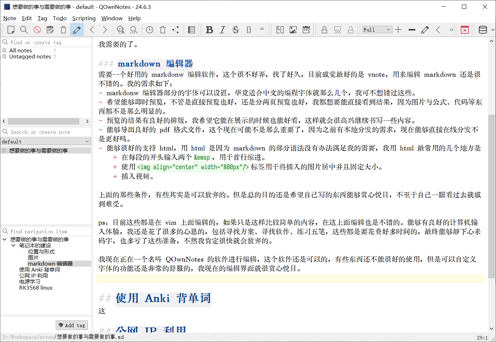

# 想要做的事与需要做的事

我需要规划一下我要做的事情，有条理的进行。

在我开始写这个笔记的时候，我才发现我是有多么的三分钟热度，或者说我有多少个想要进行的项目，我想要去做实在是太多了。而我又没有坚持，很多的事情都是开个头，然后就是一直拖在那里了，或者是有一些项目上花费了精力与金钱，由于没有做得很好，最后还是没有进行下去，导致日常想用的时候又是问题百出，不能正常使用，很是不爽。

感觉自已想要做的每一件事情都很困难，有些事情有简单的解决方案，但是我总是想要去整那些看似更好的，导致前进十分困难，会出现畏难情绪。

而且自己太贪玩了，就是不想去真正的干活，工作的时候也是这样，这样真的不好，不想做，导致心理负担真的很难受。但是如果真的向前进的时候，又会感觉做好了一件事，紧接着就会有下一件事要去做，使我非常的失落，对前进没有什么大的兴趣。事情有时会多得看不到头。

## 笔记本的建设

### 位置与形式
最后打算就是在 github 上建立这个笔记本，没有必要做个博客出来，我在看 weekly 的时候也没有去看博客，就直接在 github 的文件浏览器中看的，所以建立一个仓库就可以了。

我今天在博客园上充了一个会员，还是不忍心这个平台倒下，还是帮一下下，这个平台还是很不错的，没有像 CSDN 那样。还是希望他能够找到好的出路，不倒下。在使用电脑时不断的会遇到一些问题，每当搜索时，都希望能够看到博客园上的链接。

### markdown 编辑器
需要一个好用的 markdonw 编辑软件，这个很不好弄，找了好久，目前感觉最好的是 vnote，用来编辑 markdown 还是很不错的。我的需求如下：
- markdonw 编辑器部分的字体可以设置，毕竟适合中文的编程字体就那么几个，我可不想错过这些。
- 希望能够即时预览，不管是直接预览也好，还是分两页预览也好，我都想要能直接看到结果，因为图片与公式、代码等东西都不是那么明显的。
- 预览的结果有良好的排版，我希望它能在展示的时候也能好看，这样就会很高兴继续书写一些内容。
- 能够导出良好的 pdf 格式文件，这个现在可能不是那么重要了，因为之前有本地分发的需求，现在能够直接在线分发不是更好吗。
- 能够很好的支持 html，用 html 是因为 markdown 的部分语法没有办法满足我的需要，我用 html 最常用的几个地方是
    + 在每段的开头输入两个`&emsp`，用于首行缩进。
    + 使用``标签用于将插入的图片居中并且固定大小。
    + 插入视频。

上面的那些条件，有些其实是可以放弃的。但是总的目的还是希望自己写的东西能够赏心悦目，不至于自己一眼看过去就感到难受。

ps：目前这些都是在 vim 上面编辑的，如果只是这样比较简单的内容，在这上面编辑也是不错的。能够有良好的计算机输入体验，我还是花了很多的心思的，包括寻找方案、寻找软件、练习五笔，这些都是要花费好多时间的，最终能够静下心来码字，也多亏了这些准备，不然我肯定很快就会放弃的。

我现在正在一个名叫 QOwnNotes 的软件进行编辑，这个软件还是可以的，有些东西还不能很好的使用，但是可以自定义字体的功能还是非常的舒服的，我现在的编辑界面就很赏心悦目。

    

挑来挑去，最后发现还是 VsCode 最好用，搭配上 Markdown Preview Enhanced 插件还是很好用的，唯一美中不足的是在这里面导出 PDF 文件没有目录，因为利用 Chrome 将网页打印成 PDF 就是没有目录的。还有一个 prince 导出 PDF 的方法，但是这个软件不是免费的。总之还是差了这一点。

### 图片
我本来想着的是用一个图床，用来在网络上存放这个笔记本的图片，希望能够免费、持久、不被墙，[sm.ms](https://smms.app/)就是我需要的了。

上面说的软件 QOwnNotes 最后还是放弃掉了，因为这个软件在插入图片的时候会进行缩放，但是这个缩放的质量不太好。虽然在进行缩放后再插入是一个好的想法，可以使用原生的 markdown 语法进行图片插入，而不需要考虑图片大小的问题。其实我还是希望 markdwon 语法可以支持对图片进行缩放。很多软件都有自己的拓展语法，但是他们之间并不通用，我建设这个笔记的时候就是希望能够不依赖特定的软件，能够以独立的格式还存在。

考虑到缩放后再插入图片的做法，我还想到之前的一个图片处理服务器，可以通过在 URL 中加入特定的参数，让服务器返回的图片是缩放后的，这样在预览中展示的图片就是预定的大小了。

但其实，回过头来想，我总是认为基于服务器的服务是非常不可靠的，尤其我又是希望可以一劳永逸的那种人，有时搭建好的东西可能很久都不去碰了，突然有一天想起需要去用到，我真的希望它还是好的，可用的，而不是又要重新去花时间去搞定这件事情。

选择点：
+ 图片放在服务器上，更方便，有丢失的风险。
+ 图片放在本地文件夹，更可靠，但处理会麻烦一点。

所以我还是想着把图片放在本地，直接上传到 github 上，这样我在其它的设备中 pull 时，就会把图片也拉下来了，图片在本地总是安全的，不用担心各种各样的问题了。

那么现在就只有一个问题需要解决了，就是对需要插入图片的快速处理，减小需要插入图片的大小，放到 images 文件夹就好了，图片缩放与居中还是用 html 要描述好了。

目前新发现了一个问题，如果不翻墙的话，存放在 github 上的图片是无法显示的，这个倒是有点麻烦。目前我的文档也不需要共享给别人去看，所以这个问题先不管吧。

技术点：
+ 图片的处理方法。

图片的压缩可以选择 [squoosh](https://squoosh.app/)，这个提供了很多的图片压缩算法，并且可以进行对比，非常好。

那么最后的问题，这个images 文件夹是一个总的好呢，还是像之前那样每篇文章都创建一个单独的文件夹，然后在这个独立文件夹中创建一个 images 文件夹呢？

如果是一个总的文件夹来存放所有的图片，那么所有的文章最好不要做分级目录，因为一但采用分级目录，会导致图片的相对路径发生改变，这样不好。如果这样做，最好是能将所有 markdown 文件放在同一目录下，然后在 markdown 文件的标题上做出分类，但是这样如果要修改分类时就会要改很多的文件了。没有复杂的文件结构会一目了然一点。

如果每篇文章都有自己单独的文件夹的话，图片管理会复杂一点。其实我之前一直都是这样去做的，引用图片的时候也会方便一点，不过这样每篇文章都是相互独立的了，不能做链接引用。并且如果采用分级目录的话，整体会变得非常的不直观，到时候就不知道文章放在哪里了。

选择点：
+ 所有的文章图片归集在一起。
+ 每篇文章单独处理自己的图片文件夹。

## 目录

这里是做为整个 Notes 的入口，会有一些大体的分类，可以记录一些想法，如果已经有明确的打算的话，会分离出去，并建立链接。总是会想得多，做得少。

### general

+ [英语](./general_英语.md)

这里只是记录一些基础的内容。不做更多区分，任何时候都会去用到。

### electronics engineering (ee)

+ [芯片选型](./ee_芯片选型.md)

### computer science (cs)

#### design

+ [MVC 模式](./cs_design_MVC模式.md)

### pro

+ [个人服务器](./pro_个人服务器.md)
+ [辉光管时钟](./pro_辉光管时钟.md)
+ [雕刻机](./pro_雕刻机.md)

记录具体项目前进过程中的想法（需求）、技术选择、落实情况。

### guild

+ [msys2](./guild_msys2.md)

用来记录一些小设备、系统或软件的配置，非常细节性的内容，有可能会存在交叉。

### personal computer collection (pcc)

+ Dell_Inspiron_15_5547
+ Gigabyte_aero_15xv8
+ Panasonic_cf_mx5
+ 龙芯_3a5000
+ ThinkPad_a31
+ ThinkPad_t43p
+ Gigabyte_aero_17xc
+ HP_zhan_66_pro_a_14_g4

可以说是从 guild 列表中抽离出来的，因为 pc 对于我来说是非常特别的，我也很喜欢收藏这些电脑，尤其是笔记本电脑，非常好看。

### clock collection
我真的很喜欢时钟，我喜欢这种记录时间的设备，更喜欢自己去制作时钟，这里记录着我拥有过的时钟，个人的美好记忆。
