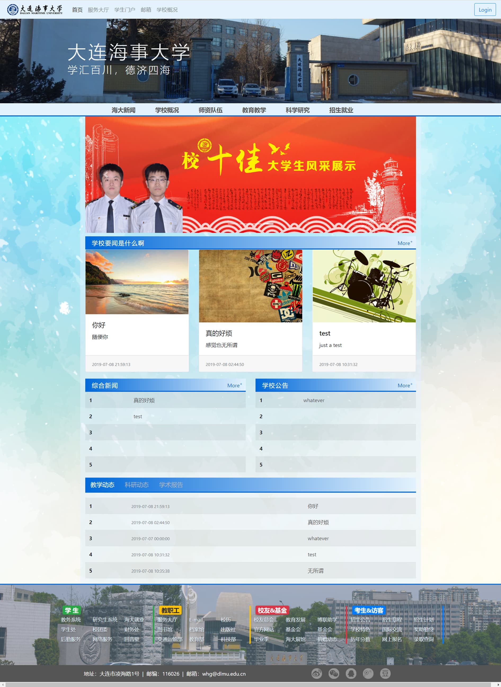
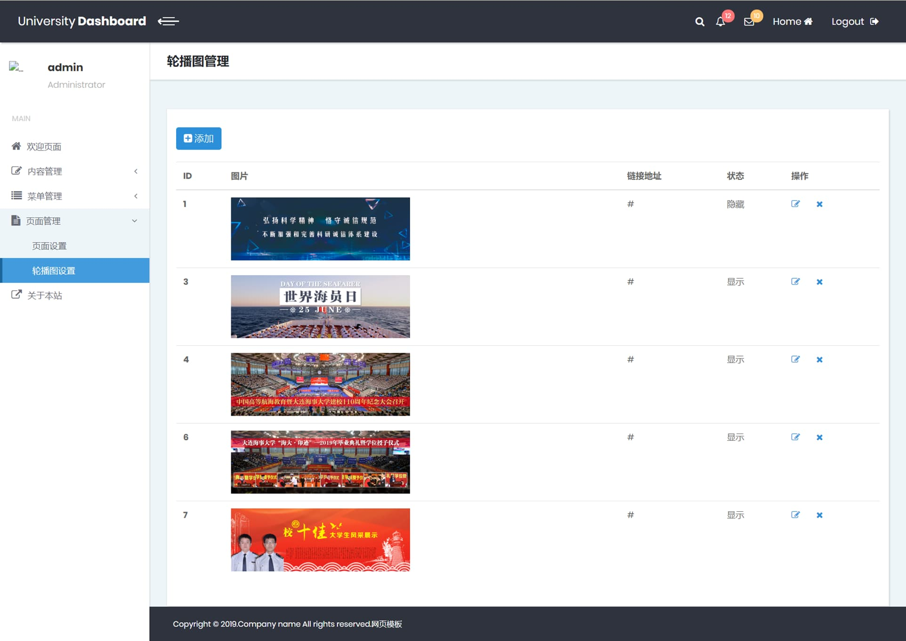

# MVC 模式

MVC 这个词从我开始进入信息系统学习的时候就开始听到了，但是这其中具体的实现细节还是要再想想的。

MVC 所联系的就是 GUI 程序，在浏览器中显示也好，以传统的 GUI 程序界面显示也好，MVC 是一种思想，能够将显示、运行逻辑、数据分割开，不让它们揉在一团，需要根据这种思想建立一个良好的执行框架。在给 GUI 程序增加功能、修改界面、更改逻辑时有一个稳定统一的模式，这其实又引申到设计模式上的问题了。

如果说我在大学时有什么需要后悔的事情，没有好好听讲面向对象这门课肯定可以算得上一件，当时老师带我们用设计模式将一个 Java 程序一点点重构，使之更加符合一个良好程序的要求。当时没有好好学习，实在是不应该。这其实是我现在一直头痛的事情，如何正确地使用软件的特性来实现良好的设计模式，使得程序能够更可信的走下去。

这篇笔记先不介绍 MVC 的概念了，我需要的是实现的框架，所以从我之前做过的信息系统软件上来体会。我大学时共做过两个信息系统，一个是内容管理系统，BS模式，Server 上是用 ThinkPHP 与 MySQL 进行搭建。另一个是订单管理系统，同样也是 BS 模式，Server 上是用 Node 与 MySQL 进行搭建。

## 过去的项目

### 内容管理系统
这个是 web 后端设计的大作业，当时还是什么都不知道的状态，接到这个作业后，非常的头痛。当时学习的后端编程语言是 PHP，问学长知道要去找 ThinkPHP 的框架，最后在 Youtube 上找到了一份 ThinkPHP 的 CMS 网站构建教程，现在知道是 singwa 的[前端到后台ThinkPHP开发整站](https://coding.imooc.com/class/chapter/48.html#Anchor)，源代码可以在 [github](https://github.com/Mrguan12/singcms) 上找到。当时没日没夜地整了一个星期，最后还是把那个 CMS 搞出来了，后来也就没有后续了。

在学习这份课程的时候，第一次真正接触到 MVC 模式的实现，感觉非常的神奇。跟着这份教程做也确实有很大的收获。虽然这些东西可能已经过时了，或者说 PHP 都已经过时了，但是，对于软件结构的感受还是可以记录的。好在当时有写实验报告，所以恢复记忆不是那么的困难。

#### 系统介绍
这个内容管理系统需要管理的东西是上学期 web 前端设计的大作业，当时是仿照海事大学的首页网站山寨了一个。所以需要管理的就是这个山寨大学首页网站的文章、文章分类、轮播图等。

展示一下当时做的网站前台首页，虽然抄了很多的样式，偷了很多素材，但是网页最后实现的结果还是不错的，如下图：

    

从右上角的`Login`按钮点击进入到登录界面，登录后就可以进入到网站后台，在后台中就可以对前台中的大部分内容进行管理。展示一下其中的轮播图设置页面，如下图：

    

#### 框架结构
以上就是对这个系统的介绍，下面会介绍下这个框架的大体工作方式。由于工作方式为 BS 模式，程序是运行在服务器端的，浏览器通过 URL 访问服务器对应的服务，并通过 GET 或 POST 方式来传递必要数据，之后服务器端程序获取相关数据并进行处理，处理结束后将渲染好的页面，也即 html 文件，传递浏览器，浏览器负责将 html 文件进行解析并展示最后界面。

### 订单管理系统