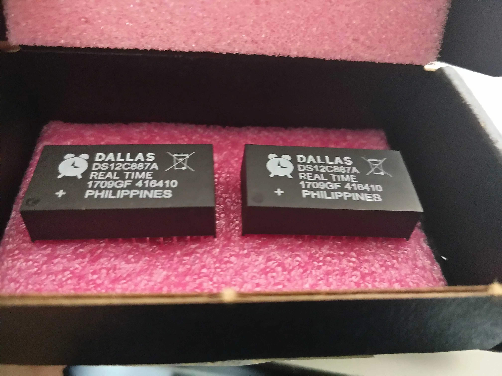

# 芯片选型

这个真的是早早就该记录的，因为做为电源工程师，经验是非常重要的事情，因为物理的芯片到底是不是好用，可能会存在哪些问题，这些都只有试过了才知道。在大学的时候，一般是学长推荐用什么芯片，我就会去用什么，后来会去上网去查下热门的芯片，记住这些芯片的名字一直是我感到骄傲的事情，我会很喜欢报出这些芯片的名字。后来，工作上是做为软件工程师，关注的只有一类芯片，就是 MCU，其它种类的芯片，尤其是辅助电源的芯片，关注得越来越少，还是应该了解一下这些方案，做为电源工程师来说。

实际上，记录这些还有一个重要的原因，就是需要考虑芯片获取的难易程度和成本。如果能有好用的国产芯片，那当然是最好的了，但是国产芯片的坑还是让我有点望而生畏。

## RTC

我是一个非常喜欢时钟的人，我喜欢精确的时钟，也喜欢制作时钟，所以好用的 RTC 一定要记录下来。

+ [DS12C887](https://www.analog.com/media/en/technical-documentation/data-sheets/DS12885-DS12C887A.pdf)：不得不说，当我从记忆中准确的说出这个芯片的名称时，我还是又骄傲了一下。这款芯片是我接触得最早的一款 RTC 芯片，是从天祥大哥教学 51 的那本书上知道的，也是我申请的第一款芯片，也让我知道了 maxim 这家芯片公司。该芯片的通信方式还是古老的 Motorola Bus 或者 Intel Bus。它有一个系列，其中 DS12C887 的体积非常大，里面集成了晶振与锂电池，这么一想其实还是很方便的。

    

这是当时刚拿到时的照片，免费的芯片从好远的地方寄到我的手中，真的是非常的高兴。我尝试用这个芯片和 51 做了一个时钟，但最终没有将这颗芯片用起来。
这颗芯片非常的古老了，精度并不是很高，大约一个月会出现一分钟的误差。供电电压 4.5V-5.5V，正常供电时，最大电流会有 15mA，后备电源供电时，最大电流为 500nA。

+ [DS1302](https://www.analog.com/media/en/technical-documentation/data-sheets/DS1302.pdf)：与上面那颗相比，这个用的就很多了，但是它使用的是外置的晶振，我一般就会用那种圆柱型的晶振，精度不好，但是它是一颗 8 pin 的芯片，比上面那个大块头要小多了，通信使用的同步串口通信，共三个引脚。支持后备电源，并拥有一个可编程的涓流充电器，可以给后备电源充电。芯片非常的小巧紧凑。
供电电压为 2.0V-5.5V，正常供电时，最大电流为 0.4mA(2V)、1.2mA(5V)，后备电源供电时，最大电流为 0.3uA(2V)、1uA(5V)。

+ [DS3231](https://www.analog.com/media/en/technical-documentation/data-sheets/DS3231.pdf)：这颗芯片我只用过一次，在第一个辉光管时钟上用的，这颗芯片给我留下了非常深刻的印象，因为它太准了，那个钟有网络对时的功能，但是后来 API 失效后我就没再使用了，但是因为这颗芯片，它一直都很准。唯一的缺点就是这颗芯片有点太大了，由于要将晶振内置。

+ [RX-8025](https://download.epsondevice.com/td/pdf/app/RX-8025SA_en.pdf)：终于换了一家公司了，这是一颗 EPSON 公司的 RTC 芯片，我使用它是利用其精准的时钟输出，来替代一个石英钟内部的晶振，但是它也是一颗完善的 RTC 芯片。

+ [SD3078](https://www.whwave.com.cn/SD3078)：囯产芯片，兴威帆公司的产品，我有点兴趣。