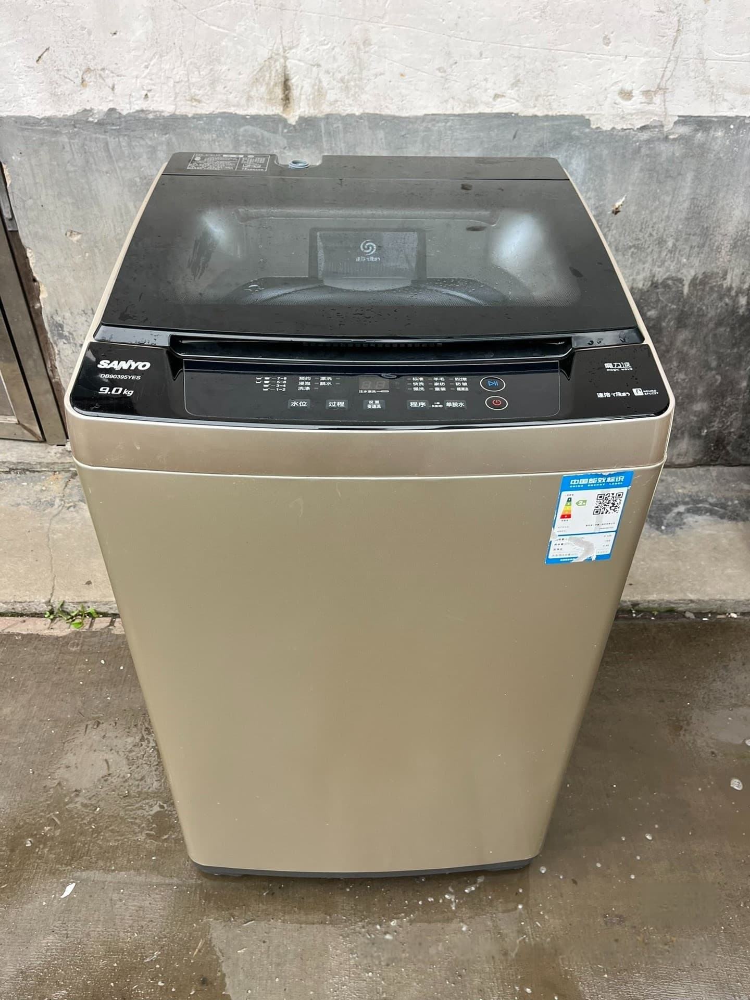
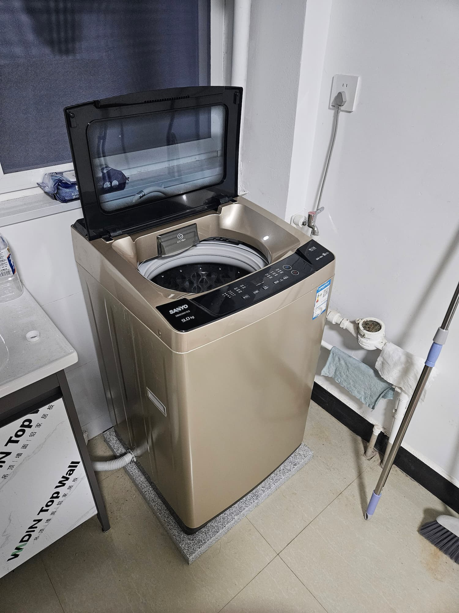
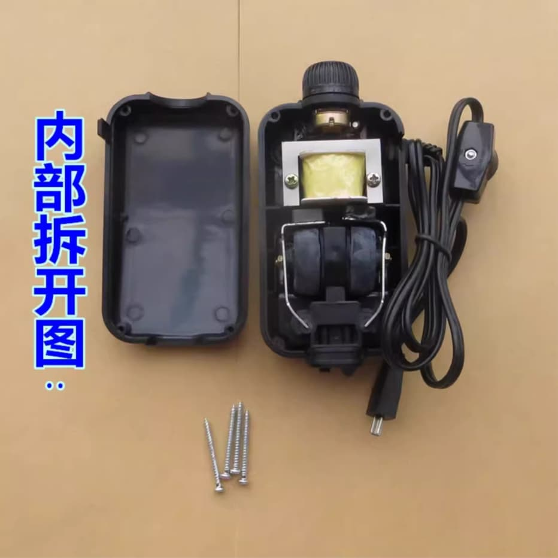
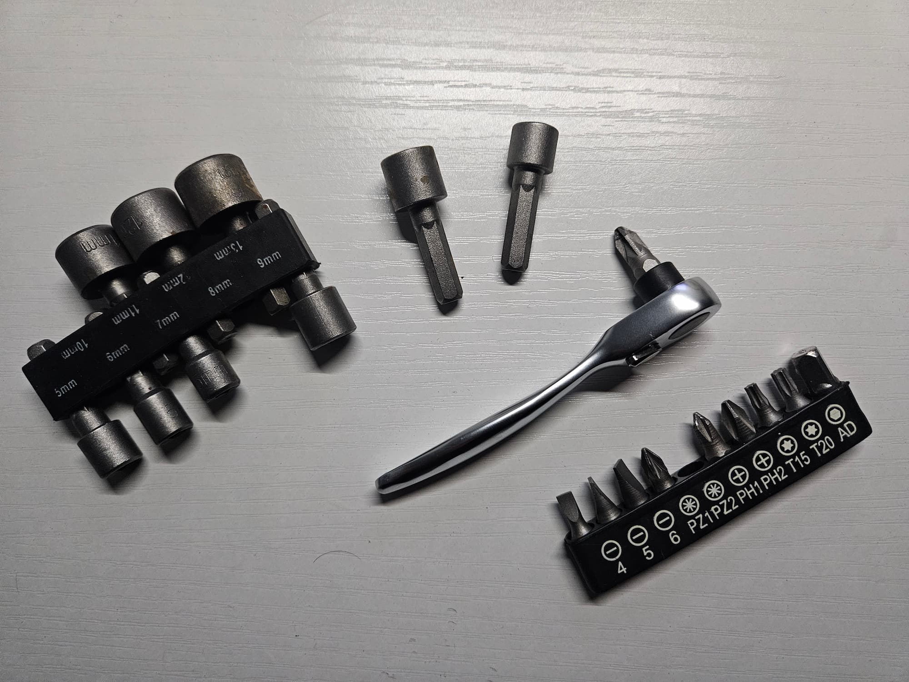
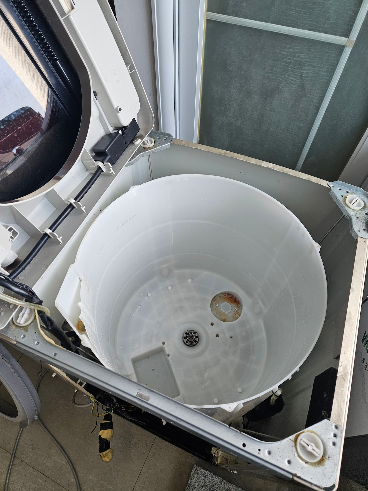
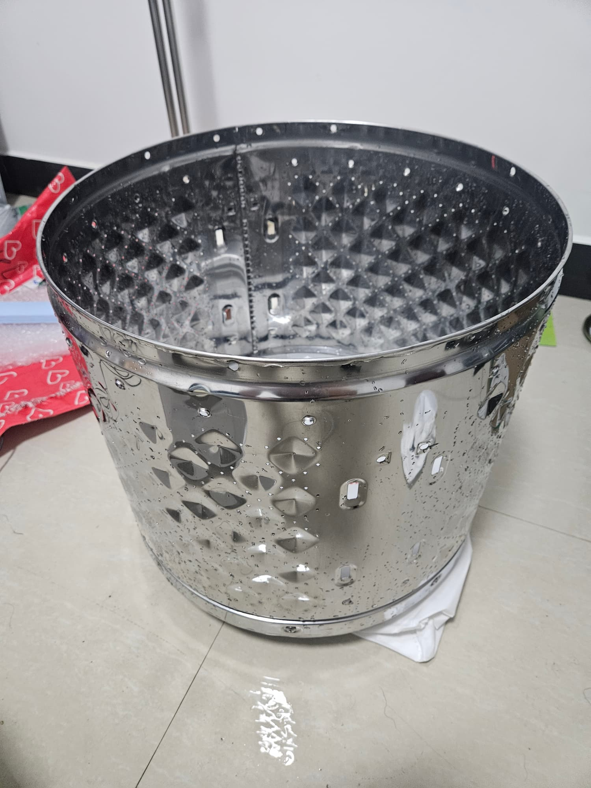
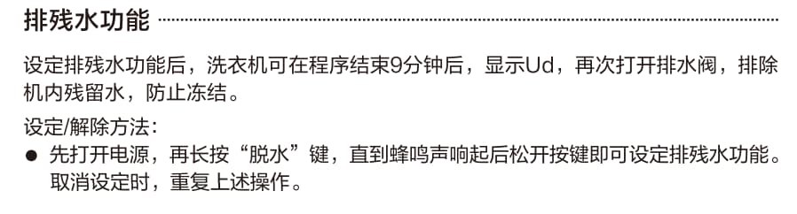

# SANYO 洗衣机

## 初见

这是我刚来到长沙这边打工时买的洗衣机，因为我一直都不太会手洗衣服，也十分不想手洗衣服，所以洗衣机成为了我的必需品。当然这个洗衣机也是在某鱼上面淘来的，就在一家在本地卖二手洗衣机的商家那里买的，并且委托他送过来。我还记得当时他安装完给我演示的时候用很有趣的湖南口音普通话和我说：“这洗衣机，劲大着嘞！”。

    
    
商店里的照片

这个洗衣机名牌是三洋，型号是 DB90395YES，当我买回这台洗衣机时，我的第一感觉是与老家的洗衣机好像啊，和老妈通电话并上网查找[资料](https://zh.wikipedia.org/wiki/%E6%83%A0%E8%80%8C%E6%B5%A6%E4%B8%AD%E5%9B%BD)后了解到家里的洗衣机是帝度牌的，与合肥三洋洗衣机是同一家公司的，所以这才看起来这么像，好吧，有多那么一点点家的感觉。

    
    
安装好的照片

## 疑问
在用洗衣液对洗衣机做简单的清洗之后，我就开始开心的洗衣服了，但是我很快就发现了一个异常的现象，就是每次洗完衣服之后的一段时间，这个洗衣机会再次被唤醒，然后运作一下，并且在面板上显示 Ud。动作时的声音像是小电机运转的声音，过一会就关闭了。

我认为这个 Ud 是错误码，于是去网上搜索相关的信息。发现信息很少，但是我很快就被一些维修广告给误导了，有的说是水位传感器故障，有的说是排水不通畅。总之，我开始认为这个洗衣机存在故障，由于是在排水后动作，我开始怀疑是不是真的是排水不通畅导致的。我发现宿舍里的排水管位置比较高，会不会是因为这个原因呢？怀疑渐渐地变为了肯定，我想当然的确信就是这个原因。

于是我开始想办法将洗衣机垫高一点，就像我之前在西丽住的时候那样。我开始在公司附近寻找砖头之类的东西。我一开始找到了轻质砖，块头很大，也很轻，我想这个真的很好，但是我只找到了一块，要垫高洗衣机至少需要两块才行。我又找到了一种铺人行道的石砖，虽然高度不及轻质砖，但是数量很多，可以随便拿。但当我尝试抬起一块时就觉得不太行，这个砖实在是太重了，真的好重，后来用体重秤称了下，一块 20Kg 有余。但是最后我还是借用了下那个工地上常见的两轮推车，搬了两块到宿舍去了，并垫到洗衣机下了。最终效果就是上面那张图片。

垫高之后我当然迫不及待的使用了下洗衣机，希望不再出现那个故障码。然而最后还是让我失望了，它还是如约的出现了。而此时我已经钻进牛角尖了，认为一定是排水的问题，肯定是这砖的高度不行。于是，傻傻的我又去搬了两块砖，叠在一起，最后把洗衣机放了上去，心想，这下总不会还有问题了吧。然而，现象依旧。我感到有点失望，有点懊恼，但更多的是想要放弃了，这个问题原因也不知道，也不影响洗衣，要不就这样了吧。于是我就将这个问题搁置了。

## 深入
周六，本是轻松愉快的一天，我在宿舍里想要打扫一下卫生，又看到了那个洗衣机，以及下面叠放的两层砖，我又想去整它了，想仔细看看到底是什么问题，我打开了洗衣机的后盖，并把洗衣机放倒，很清楚地看到了里面的各种组件，有电机，有皮带，有排水管与排水阀，一些其它的透明管道。大部分的功能我都不清楚，于是，我知道，想要找到问题，就得先了解洗衣机的原理了。

虽然洗衣机的资料不如计算机的资料那么多，但是好在现在乐于分享的人还是有的，我找到了一些，比如下面这些：
 + [全自动波轮洗衣机维修全拆卸零部件讲解](https://www.bilibili.com/video/BV14zAWeLE1L/?share_source=copy_web&vd_source=0359c92402c94dc14facc2a03dd1b66d)
 + [全自动洗衣机全拆，以及它的工作原理。](https://www.bilibili.com/video/BV1yqCzYAE3v/?share_source=copy_web&vd_source=0359c92402c94dc14facc2a03dd1b66d)

在看完这些视频之后，我很确定我已经很懂洗衣机了，于是就对照着自己的洗衣机去看，嗯，外桶，电机，离合器，牵引器，排水阀，水位器管道，这些都可以一一对应。但是我发现了一个在上面并没有介绍到的一个设备，也连接着管道到外桶，我不太确定这个是什么，感觉像是一个水泵，于是将它拆了下来，打开一看，发现里面有电动机结构，还有两个气室，我确定这是一个气泵，结构类似于下图：

    
    
淘宝找的图片

PS：如果我以后真的想要记录自己的生活的话就应该多拍照，大脑里的图像不管清晰还是模糊都导出不了。

里面有电动机结构也符合洗衣机在显示故障码时发出小电机运转的声音，我相信当时在运作的就是这个气泵，所以说，洗衣机里要这个气泵做什么呢？继续步网找资料，然后就找到了一篇专利，[一种波轮洗衣机](https://patents.google.com/patent/CN114717787A/zh)，专利中有描述气泵，并且通气口的位置与我的洗衣机相符，其描述如下
> 外筒的底部设置有连通外筒内外的通气孔，气泵与该通气孔连通，从而气泵中吹出的气体可以通过该通气孔进入道外筒内，内筒与外筒同轴设置，且沿周向可旋转设置在外筒内，外筒的底部设置有连通内筒内外的导气孔，从而进入到外筒内的气体可以沿导气孔进入到内筒内，从而，进入内筒内的气体可以水中，气体可以溶解入水中成为气泡水，含有气泡的水在波轮的搅动下进行衣物洗涤，通过气泡的破裂与水流的冲刷，加速去除衣物表面附着的污渍，提高波轮洗衣机洗涤衣物的洗净比。

嗯，有点类似超声清洗的原理，洗衣机的气泵应该就是这个作用。我继续观察了下洗衣机，气泵安装在外桶的底部，其连接的透明软管先往上走并超过内桶的最大高度，然后再往下走连接到外桶底部的通气孔，绕这个大弯应该是防止气泵没有工作的时候，桶内的水经过通气孔流到气泵里。但是问题是，连接外桶通气孔到最大高度的那部分软管内部真的好脏啊！！！

至此我才终于认识到一个更加严重的问题，这个洗衣机的内部应该是非常的脏，所以连接外桶的那部分软管才会那么脏。于是我的目标变更了，从找到 Ud 故障的原因变更为清洗洗衣机。由于之前学习了洗衣机的结构，所以如何拆解清洗不再有问题。好在我有一个小小的棘轮扳手，还带有套筒，使拆解成为了可能。

    
    
小小的棘轮扳手

当然，可能并不意味着简单，在拧开固定内桶的四颗六角螺丝时，不用大力又拧不开，用大力又很容易伤到手，所以以后在做这些活的时候一定要戴劳保手套。拧开固定内桶的螺丝后，我并不能像视频中那样轻易地把内桶提出来，实际上，我根本就不能把内桶拿出来，此时，我真的是又累又难受，眼看着那肮脏无比的外桶内壁，而我又不能把内桶提出来清洗，糟心。
于是，我决定休息一下，看一些清洗洗衣机的视频，看看别人是如何把这个内桶弄出来的，然后我就看到了[这个视频](https://www.bilibili.com/video/BV1JK4y1h7bd/?share_source=copy_web&vd_source=0359c92402c94dc14facc2a03dd1b66d)，我看到他用了拉马，其实我也想到了这个工具，但是我当时还不知道这个叫拉马。看完我心凉了半截，拆个洗衣机还要用拉马，我又没有，在网上买又要花个几天才能到，这几天总不能把洗衣机就这么放着吧。伤心之余，我又看到了[另外一个视频](https://www.youtube.com/watch?v=B1QyJTlJ1aA)，他说稍微晃动一下，这样方便取出来。这无疑又给了我很大的信心，于是我又到洗衣机旁，尝试晃动一下，这回真的成功的取出了内桶。我还总结了经验，因为有离合器，内桶只能顺时针旋转，而逆时针是转不动的，利用这一点，先顺时针小转下内桶，然后向逆时针用力，由于转不动，内桶与离合器的连接处会受力撞击，就这样撞几下，内桶与离合器轴就分开了。这样就可以取出内桶了。

取出内桶之后就是开始刷洗内桶与外桶了，这也是最累人的。清洗前的图片就不放出来了，放两张清洗后的图片吧（当然也是因为只拍了这两张照片）

    
    
清洗完成后的外桶

    
    
清洗完成后的内桶（部分）

因为没有特别好用的清洗工具，还去到超市买了刷子，清洗洗衣机的清洁粉。洗完并将整机装起来之后，又用那个清洁粉浸洗了一下。至此也算是大功告成了。不得不说，清洗洗衣机这件事可以算得上是我干过最累的了。

## 尾声
清洗完洗衣机之后，我还想看看那个 Ud 是否还在，于是我又洗了一次衣服，不意外的是它又出现了。于是我想着，那个问题就这样了吧，虽然并不完美，但是洗衣机本身并没有发现有什么问题。

然而我还是不甘心，又上网好好找了下与 Ud 有关的资料，搜索到一篇文章，[三洋XQG85-T1099BHX洗衣机故障排除指南](http://www.sanywx.com/changjianwentijieda/2691.html)，里面的故障说明排版很乱，但是还是找到了我关心的 Ud 故障码的说明：
> UD 运转后显示 是否设置了排残留水程序

是的，就是这样短短的一句话，又重新打开了我的思路，排残留水程序？这个还真的是有可能的，我又顺着这个关键词去寻找，果然，我在其兄弟品牌的洗衣机说明书中找到了明确的说明，说明书是[帝度 DDD8003220W](http://www.diqua.com/uploads/files/default/20220110/20220110052809.pdf)，在第 18 页有对排残留水功能的说明：

    

至此，Ud 问题终于被圆满解决，我也更加喜欢这台洗衣机了。