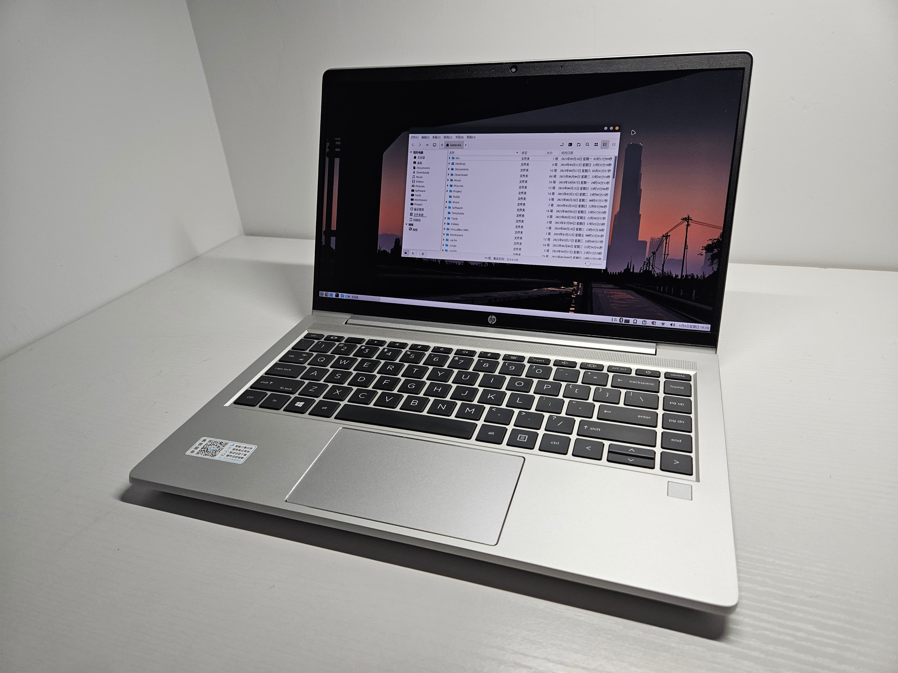
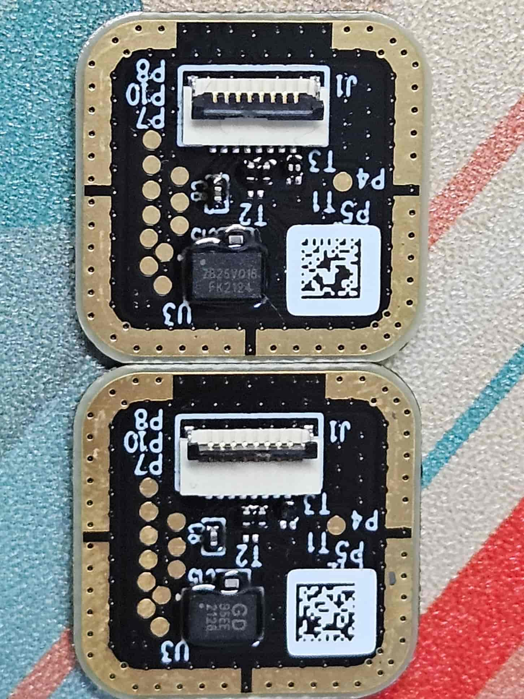
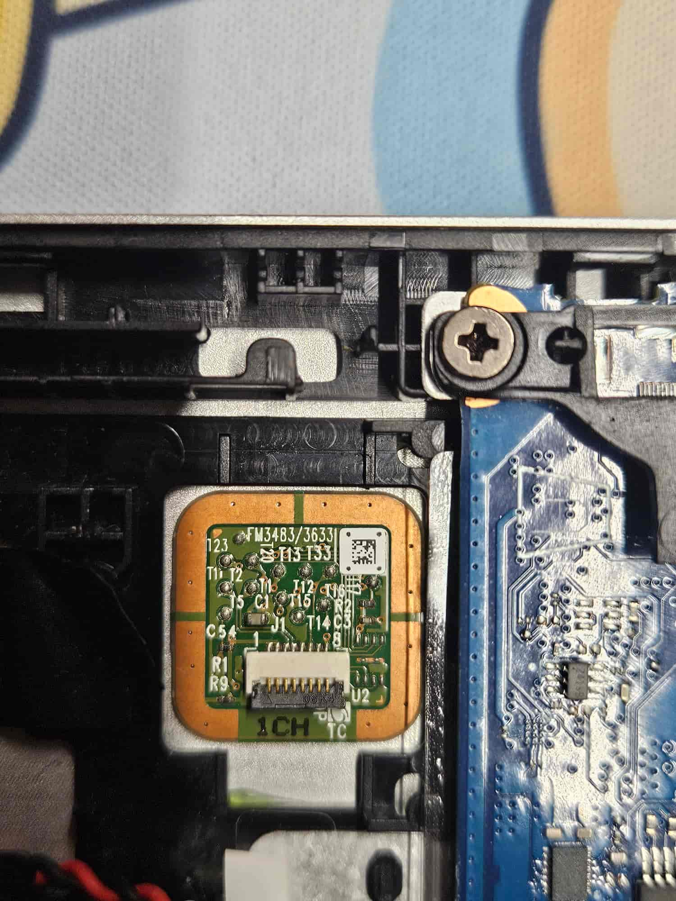

# HP Zhan 66

买这台电脑的原因是当时想要一台单纯的 linux 工作电脑，并且当时也很想要一台 AMD CPU 的电脑，两种情绪相结合，就在闲鱼上购买了这一台电脑。

<div align="center">
    
</div>

## 指纹识别模块
第一次在安装了 Ubuntu 之后，一切看起来都很好，唯独除了指纹识别不能正常工作，上网找了一些教程，但是最终没有成功，并且把我的 Ubuntu 系统弄坏了，只好重装了系统。之后就不再管这个外设了，毕竟我其它的电脑也没有指纹识别。但是在时隔两年后，一次心血来潮又让我开始搜索驱动这个外设的方法，最终让我的这台电脑拥有了指纹识别的功能，这也是我写这篇文章最大的动力。我想记录下在 linux 下驱动指纹识别的全过程。

其实，这条路前人已经帮我走过了，我只需要按着他的教程一般就没有问题了，参考的教程是[战66四代更换指纹模块，兼容Ubuntu](https://post.smzdm.com/p/a0x2ell8/)，教程发布的时间是 2024 年 8 月，所以第一次尝试解决指纹问题时就没有找到这个教程。这篇文章提供的最大价值首先是明确否定 Zhan 66 电脑上的指纹识别模块在 linux 上是不能够驱动的，而后提出了解决方法，也即更换在 linux 上可以驱动的指纹识别模块硬件。按照这个方法我也最终成功在 Linux Mint 系统上实现了指纹的功能。

接下来记录的内容主要是将这篇文章的过程走一遍（防止哪一天就看不到了），然后还有自己在实践过程中遇到的一些坑和解决方法，也一并记录下。

首先是确认指纹模块的信息，输入以下命令：

```shell
$ lsusb
Bus 001 Device 001: ID 1d6b:0002 Linux Foundation 2.0 root hub
Bus 001 Device 003: ID 8087:0a2b Intel Corp. Bluetooth wireless interface
Bus 001 Device 004: ID 04f3:0c5e Elan Microelectronics Corp. ELAN:ARM-M4
Bus 001 Device 005: ID 046d:c52b Logitech, Inc. Unifying Receiver
Bus 002 Device 001: ID 1d6b:0003 Linux Foundation 3.0 root hub
Bus 003 Device 001: ID 1d6b:0002 Linux Foundation 2.0 root hub
Bus 003 Device 002: ID 04f2:b6c0 Chicony Electronics Co., Ltd HP HD Camera
Bus 004 Device 001: ID 1d6b:0003 Linux Foundation 3.0 root hub
```

在这个列表里面我们就可以看到指纹模块的信息了，`04f3:0c5e Elan Microelectronics Corp. ELAN:ARM-M4`。可以知道指纹模块是 Elan 公司的产品，`Vendor ID`是`04f3`，`Product ID`是`0c5e`。

LinuxMint 类似于 Ubuntu，指纹驱动是通过 libfprint 实现的，查看[设备支持清单](https://fprint.freedesktop.org/supported-devices.html)，没有在列表中找到`04f3:0c5e`。然而在[设备不支持清单](https://gitlab.freedesktop.org/libfprint/wiki/-/wikis/Unsupported-Devices)中，可以找到该设备，以上明确该指纹模块在 LinuxMint 中是不被支持的。

接下来按原文章的指示，购买了受支持的 Synaptics 指纹模块，即 FM3483 指纹模块。下图分别展示原指纹模块与 FM3483 指纹模块。

<div align="center">
    
    <p>原指纹模块</p>
</div>

<div align="center">
    
    <p>FM3483 模块</p>
</div>

原模块会有两个是因为当时给老姐在闲鱼上选购了一台同系列的电脑，但是拿到手发现 C 壳存在碰撞变形，于是又在闲鱼购买了一个 C 壳来替换，由于是拆机件，所以上面的设备（键盘、触摸板、指纹模块）也都在。替换完后的 C 壳上的指纹模块也就被我拆下来了。与本机的指纹模块相比，可以发现 PCB 是相同的，只是那个芯片上的丝印不同，我也有抱着试一试的想法，把这个指纹模块安装上去，看下 usb id 会不会不同，但结果是相同的，最后也还是购买了那个 FM3483 指纹模块。

需要注意的是，在淘宝上搜 FM3483 会有两种类型的指纹模块，当时为了保证万无一失还特地选择了封面图完全一样的卖家，结果最后发来的还是另一种，不过好在这个也是可以用的。如果当时直接买这种的话，其实有更便宜的一家店，小亏十块。

原装的指纹模块正面会有一圈胶垫，而新买的这个没有，所以在安装的时候需要把原来的胶垫撕下贴到这个新模块上面。

安装好之后，再输入`lsusb`命令，可以看到新安装指纹模块的信息。

```shell
$ lsusb
Bus 001 Device 001: ID 1d6b:0002 Linux Foundation 2.0 root hub
Bus 001 Device 003: ID 8087:0a2b Intel Corp. Bluetooth wireless interface
Bus 001 Device 004: ID 06cb:00f0 Synaptics, Inc.
Bus 001 Device 005: ID 046d:c52b Logitech, Inc. Unifying Receiver
Bus 002 Device 001: ID 1d6b:0003 Linux Foundation 3.0 root hub
Bus 003 Device 001: ID 1d6b:0002 Linux Foundation 2.0 root hub
Bus 003 Device 002: ID 04f2:b6c0 Chicony Electronics Co., Ltd HP HD Camera
Bus 004 Device 001: ID 1d6b:0003 Linux Foundation 3.0 root hub
```

`06cb:00f0`就是新指纹模块的 Id，在设备支持列表中可以很轻松的找到。原文章到这里就已经结束了，Ubuntu 可以直接识别到这个模块然后开启指纹功能，而在 Linux Mint 中，开启指纹功能并不是那么容易。

为在 Linux Mint 中开启指纹功能，我尝试按着[视频教程](https://www.youtube.com/watch?v=C3b4_XJnwNk)的流程走。需要执行以下命令。

```shell
$ sudo apt install fprintd
# 安装 ok

$ sudo apt install libpam-fprintd
# 安装 ok

$ sudo pam-auth-update
# 将 Fingerprint authentication 选上

$ fprintd-enroll -f right-index-finger
# 录入右手食指的指纹
# 失败，fprintd item could not find any compatible device

$ fprintd-verify
# 验证已经录入的指纹
```

在录入指纹的时候，发生了报错，说未找到兼容的设备。又在网上找了一大圈，也试了一大圈，最终找到了可行的解决方法，在 [reddit 的一篇讨论下](https://www.reddit.com/r/Ubuntu/comments/1185rx6/got_synaptic_fp_scanner_synaptics_06cb00be/)，楼主遇到了与我一样的问题并提供了解决方法，并且找到解决方法，有一位大佬重新构建了 FP 驱动库，可以让 Synaptic FP scanner 被识别。楼主编译了这个驱动最后成功使用指纹识别功能，并且记录了下过程。

首先是工具的[仓库地址](https://github.com/Popax21/synaTudor)，下载下来后首先需要在电脑上配置一下编译环境，如下命令：

```shell
sudo apt install meson cmake pkg-config libcrypto++-dev libusb-1.0-0-dev libcap-dev libseccomp-dev libglib2.0-dev libdbus-1-dev libfprint-2-dev libfprint-2-tod-dev libjson-glib-dev innoextract libssl-dev
```

之后再按照仓库中的说明的编译方法对工具进行编译和安装，完成之后就可以正常使用指纹识别功能了。

说实话，Linux Mint Mate 桌面环境对指纹识别的适配做得并不是很好，在登录时，可以使用指纹登录，但是如果失败或超时都没有重试的机会，只能输入密码。在命令行中输入 sudo 命令时，也是一样，不过当指纹识别正常工作时，还是很流畅的，不需要再输入密码了。这也是这次折腾最后的收获。