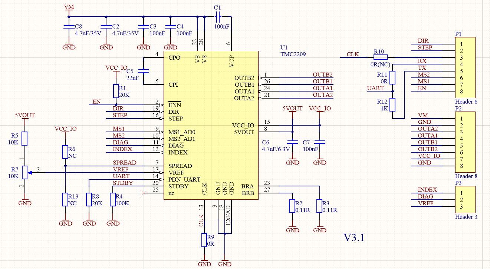

# 激光雕刻机

关于为什么要买激光雕刻机，起因还要回到卓大的[这篇文章](https://mp.weixin.qq.com/s/hYrdXWLdZk44b4F8lOFUSQ)，利用激光打标机制作 PCB，其方式是先在覆铜板上涂上一层三防漆，然后用激光打标机在三防漆上刻出想要的花纹，最后使用盐酸与双氧水对电路板进行腐蚀，我发现其精细程度真的是超出了的想象，回想之前用墨粉压印到覆铜板上的方式，真的是没有可比性，所以我也想要整一下。

由于购买的时候没有做太多的功课，在闲鱼上随便买了一台激光雕刻机，名称是雕途 T1，如下图

    

其硬件的做工还是可以的，但是其配套软件实在是不敢恭维了，这台机器我只是简单测试了一下，就放在那结蜘蛛网了，当时的痛点主要是**配套软件难用**。制作电路板一直没有进行下去，是因为当时想画那张 LCD 驱动的板子越来越复杂，在单层板上不再可能完成 Layout。之后那张板子也失去了兴趣，没有后续了。

后来有了新的想法，需要用到激光雕刻机的切割功能，又是难在了那个难用的软件上了，连 SVG 文件都不能支持，最终是不想再凑合了，想着整一套新的软件。

其实，从事后回顾的角度来看的话，当时卓大使用的激光打标机，类似下图的机器

    

这个机器可以进行金属雕刻，可以在金属型材外壳上雕刻商标或是其它的文本。它的特性是中间的激光头不会移动，而是直接调整激光的射出方向来进行雕刻，由于这个特性，它雕刻的速度会非常快。相比之下，我购买的那种通过步进电机移动整个激光头的雕刻机，其雕刻的速度会慢上好几个数量级。不过，由于激光的方向与操作平台并不垂直，我认为这种激光打标机应该不能够切割面积比较大并且比较厚的锻木板。

但回到制作电路板的问题上，这种激光打标机就非常合适了，速度快，并且涂覆在覆铜板上的三防漆比较薄。使用这种机器可以以非常快的速度将电路雕刻出来。

但是仅从外观上就可以看出来这两种机器的价格也不在同一个数量级上，所以一号方案才是 DIY 的最好方案。

## 软件替换
我一开始的想法是想着监听上位机与雕刻机之间的串口通信信息，然后破解其通信协议，这个想法实在是太天真了。首先是折腾了半天终于成功监听到了串口的通信信息，而且还不是乱码，但是除了开始的一连串握手信息能够看懂以外，就什么也看不懂了，如果要破解协议，估计要花费很长的时间。而且就算我成功破解了协议，我也不知道怎么进行后续操作。

但是呢，这些时间花费得也不是完全没有意义，还是习得了一套串口通信的监听方法，虽然不是什么黑科技，但是还是重在实践嘛，也是值得记录下来。

## 开源软件
当我最终放弃去破解协议后，我把手又伸向了互联网，看看有没有什么开源软件能够直接满足我的需求，然后果然就发现了一些，真是不得不说，这些开源软件的贡献者真的是人类之光，真的希望有一天我的实力也足够强，能够加入他们，也成为开源世界出一份力。
+ [LaserGRBL](https://lasergrbl.com/)：开源的激光雕刻机的上位机，是用 c# 编写的，所以最好还是运行在 windows 系统上，但是借助 mono 应该也可以运行在 linux 上，具体可以参考这篇讨论，[Run on Linux/Mono](https://github.com/arkypita/LaserGRBL/discussions/1764)，并且在最后有人成功做了移植，给出了编译好的二进制包，参考该 [fork](https://github.com/hovercraft-github/LaserGRBL-MP/tree/v6.2.2-mono6.12.0.200)，相关修改被提到了`linux-port`分支上。在 linux 上尝试了该分支，发现非常不好用。如果需要在 linux 上运行的话，还是先安装 wine，可以非常完美在 wine 上运行。
该软件是针对于 [grbl](https://github.com/gnea/grbl) 固件。目前我还没有让 LaserGRBL 与 grblHAL 成功连接上。
+ [Marlin](https://marlinfw.org/)
+ [LaserWeb](https://laserweb.yurl.ch/)
+ [grbl](https://github.com/gnea/grbl)：基于 Arduino 的激光雕刻机的控制程序，能否将上位机发送的 G CODE 转换成步进电机的动作信号。
+ [grblHAL](https://github.com/grblHAL)：grbl 的 32 bit MCU 移植项目，工程设计为模块化，支持多种 MCU，包括我感兴趣的 STM32F1、RP2040 等等。

## 主控
由于上位机我最终选择的是 LaserGRBL，它原生支持的是 grbl。而 grbl 是运行在 Arduino 的程序，我一直没有用过这个，甚至有点歧视（实在是不应该，我已经数不清到底有多少个强大的项目在这个 8 bit MCU 上实现了）。我当然是想用 stm32 做主控，然而我尝试过将 LaserGRBL 与 grbl HAL 一起工作，但是失败了，他们并没有通讯上，而我也不想再折腾了，于是就买了一块了一块 Arduino Nano，不过是国内的修改版，将 USB Mini 接口换成了 USB Type C 接口了，并且将 USB 转串口芯片更换成了 CH340，相对会方便一些。

主控芯片是 [ATmega328P](https://ww1.microchip.com/downloads/en/DeviceDoc/Atmel-7810-Automotive-Microcontrollers-ATmega328P_Datasheet.pdf)，高性能的 8 位机，每次想着这些强大的固件可以在这 8 位机上跑我就感觉很神奇。

## 硬件

### 步进电机
之前一直没有好好的看步进电机，上网找了些资料后，感觉步进电机的基本原理还是很简单的，就像是一个没有换向器的直流电机，这么一想，感觉机械石英钟里面的电机也可以算是步进电机。对电机一窍不通的我还是不再这里瞎总结了，之后要了解原理的话，[TI 高精度实验室-电机驱动器：步进电机](https://edu.21ic.com/lesson/2272)，这个是不错的参考资料，里面有讲基本的电机知识，还有其驱动的相关知识。
这个激光雕刻机上共有 3 个步进电机，型号是`OK42HC34-134A`，在网上没有找到相关的资料，但是还是有类似的，找到了 [NEMA17](https://www.electronicoscaldas.com/datasheet/JK42HSxx-Series_Jkong-Motor.pdf) 的 datasheet，可以参考一下命名方法，可以确定的参数是步进角度(Step Angle)为 1.8°，电机出线端为 6 端，发现原厂单板上的电机驱动设置的驱动电流为 1A。从步进电机的命名规范来看，`42HC34`中`42`表明电机外形尺寸为 42mm，`HC`表示步距角度为 1.8°，`34`表示机身长度为 34mm。后面的`134A`没有特别明确的规范，`13`应该表示电机峰值电流，10 倍定标，也可能`134`表示电机峰值电流，100 倍定标。`A`可能表示的是出轴方式，表示为圆形光轴，我还没有把雕刻机的机械结构拆开，所以这个还没有证实。

原厂单板上的共有两个电机驱动，其中一个连接到 x 轴电机，另一个连接到两个 y 轴电机。但是电机的驱动的驱动电流都是被设置为 1A。我感觉一个驱动并联两个电机，驱动的驱动电流不是应该加倍吗？网上找了些资料，根据这篇指导，[Driving Multiple Stepper Motors From a Single Driver](https://www.instructables.com/Driving-Multiple-Stepper-Motors-From-a-Single-Driv/)，博主同样需要在同一个轴上安装多个电机以提高驱动能力，但是发现将这些电机并联时，并不能提高驱动能力，因为电机驱动的电流没有增加。于是他考虑将这些电机进行串联，因为考虑电机驱动实际是进行电流控制，在供电电源功率足够的情况下，串联能够让每个电机都有相同的驱动能力，且动作一致。电机串联如下图：

    

我觉这个完全可以尝试一下，因为从原理上完全说的通。经过测试，可以确定以串联的方式连接两个电机的方式非常的好，这两个电机将完全同步，雕刻的精度又提高了一些。
串联电机的方式需要注意一点，就是只连接串联序列中其中一个电机是无法正常工作的，因为电路没有实际连接，这时需要将不使用的电机接口短接起来，用跳线帽就可以了。

### 镭射
这台机器上的镭射没有找到对应的型号，从之前的产品展示页面上可以了解到一些参数，镭射模块的功率是 15W，其光功率为 5W，光斑大小为 0.06mm，焦距固定为 2mm。还有一些切割能力数据，椴木板切割的最大厚度为 5mm，黑色亚克力最大厚度为 2mm。

### 驱动

#### A4988 / HR4988
原厂单板上的步进电机驱动为 [HR4988](http://www.szczkjgs.com/UploadFiles/fujian/3721/HR4988.pdf)，应该是 [A4988](https://www.allegromicro.com/-/media/files/datasheets/a4988-datasheet.pdf) 的高精度版本，因为 A4988 最高支持 16 微步细分，而 HR4988 最高可以支持到 128 微步细分，目前在淘宝上可以买到的驱动应该都是 HR4988 而不是 A4988 了，从数据手册上来看 HR4988 是国产的，应该会便宜点。A4988 是 ALLEGRO 的芯片，真没有想到是这家公司出的，上回听说这个公司产的芯片还是霍尔电流传感器。真正使用上还是买现成的模块，这个已经非常成熟了，基本上看到这个红色的小模块，就可以确定是这个驱动。

    

考虑到 HR4988 与 A4988 完全兼容，模块的引脚也完全一致，所以教程基本上是可以通用的。其模块接口如下图：

    
    
<a link="https://a.pololu-files.com/picture/0J3360.1200.png?d94ef1356fab28463db67ff0619afadf">图片来源</a>

接口可以简单分成功率部分与数字部分，功率部分包含电机供电与电机线圈接口。数字部分包含数字供电以及 IO 信号。
+ VMOT、GND：电机供电电源
+ 2B、2A：电机绕阻 2 引脚
+ 1A、1B：电机绕阻 1 引脚
+ VDD、GND：数字供电电源
+ ENABLEn：驱动使能引脚，低电平有效。只有当该脚电平为低时，电机驱动才会进行工作
+ MS1、MS2、MS3：对微步分辨率进行控制，这里 A4988 支持 full、1/2、1/4、1/8、1/16 细分模式。而 HR4988 在此基础上拓展了 1/32、1/64、1/128 细分模式，并且模式设置完全兼容 A4988.

A4988 模式配置

| MS1 | MS2 | MS3 | Microstep Resolution |
| --- | --- | --- | -------------------- |
| L   | L   | L   | Full Step            |
| H   | L   | L   | Half Step            |
| L   | H   | L   | Quarter Step         |
| H   | H   | L   | Eighth Step          |
| H   | H   | H   | Sixteenth Step       |

HR4988 模式配置

| MS1 | MS2 | MS3 | Microstep Resolution |
| --- | --- | --- | -------------------- |
| L   | L   | L   | Full Step            |
| H   | L   | L   | Half Step            |
| L   | H   | L   | Quarter Step         |
| H   | H   | L   | 1/8 Step             |
| H   | H   | H   | 1/16 Step            |
| H   | L   | H   | 1/32 Step            |
| L   | H   | H   | 1/64 Step            |
| L   | L   | H   | 1/128 Step           |

+ RESETn：复位引脚，低电平有效。当该引脚为低电平时，A4988 将复位。如果该引脚悬空，则A4988默认为高电平。
+ SLEEPn：睡眠引脚，低电平有效。不该引脚为低电平时，A4988 将进入低功耗睡眠模式。若无需使用 SLEEP 模式时，可以将 SLEEP 引脚与 RESET 引脚相连，此时 A4988 将一直保持在正常功耗模式下。
+ STEP：步进引脚。MCU 通过该引脚向 A4988 发送脉冲信号，A4988 接收到信号后，会根据细分配置来控制电机运转。
+ DIR：方向引脚。MCU 通过该引脚向 A4988 发送方向控制信号，当此引脚为低电平，A4988 将控制电机顺时针旋转。高电平则逆时针旋转。

在正式使用该驱动之前，需要对电机绕阻的最大电流 ItripMAX 进行调节，如若不进行调节，驱动提供的电流可能大于绕阻所能承受的最大电流，从而导致电机损坏。调节该电流的方法是通过对芯片 VREF 脚上的电压进行调节，其大小还与电流采样电阻 Rs 有关。

首先需要确定 Rs 的大小，上方实物图中，芯片左侧的两个较大电阻就是电流采样电阻 Rs，丝印上标明电阻大小为 R100，也即 0.1Ohm。而如何调节芯片 VREF 脚上的电压呢？可以通过调节模块上的滑动变阻器来进行调整。那么现在就可以根据以下公式调试 ItripMAX 的大小了。

$$I_{tripMAX} = V_{REF} / (8 * R_S)$$

根据公式，如果想要设置 ItripMAX 为 1A，那么就需要调节 VREF 脚上的电压为 1A * (8 * 0.1Ohm) = 0.8V。

更多关于 A4988 模块的资料可以参考以下文章
+ [Pololu A4988 Stepper Motor Driver Carrier, Black Edition](https://www.tme.eu/Document/25459777e672c305e474897eef284f74/POLOLU-2128.pdf)
+ [A4988驱动NEMA步进电机(42步进电机)](http://www.taichi-maker.com/homepage/reference-index/motor-reference-index/arduino-a4988-nema-stepper-motor/)

#### TMC2209
这个驱动芯片是当时想在淘宝上购买 HR4988 时发现的，有很多家都在卖这个，附带一个大的蓝色散热片，广告上说是细分程度更高，但其实这个驱动芯片的价值并不只在于此。[TMC2209](https://www.analog.com/media/en/technical-documentation/data-sheets/tmc2209_datasheet_rev1.09.pdf) 的芯片手册上说它是极度安静的两相步进电机驱动，实际使用过程中，更安静也就意味着更小的电机抖动、更高的步进精度，实际使用上也是如此，加上之前对步进电机进行的串联处理，精度真的提高了非常多，在之后的调试记录中会体现出来。

该芯片的部分参数如下：
+ 工作电压范围：4.75V – 28V
+ 每相最大电流：2A
+ 峰值输出电流：2.8 A

    
    

可能由于该驱动芯片并没有完全被 Arduino 开源社区接受，该驱动模块的样式与接口并没有统一，不同厂家之间的模块可能并不相同。并且，其模块接口与 A4988 模块并不完全兼容。网店中有给基本的引脚说明，如下图：

    

在模块的左上角还有三个引脚，从左到右，从上到下分别为`VREF`、`DIAG`、`INDEX`。需要注意的是，其引脚分布与网上可以找到的模块是相同的，但是引脚名称却不尽相同。在网络上找到相关开源资料，发现与 [FYSETC-TMC2209 V3.1](https://github.com/FYSETC/FYSETC-TMC2209) 最为类似，如下图：

    

该模块的引脚定义与我买的模块几乎一样，**除了左上角那三个引脚顺序存在差异**。通过该开源资料，我知道了该模块的原理图以及引脚功能说明。

    

+ VMOT、GND：电机供电电源
+ M1A、M1B：电机绕阻 1 引脚
+ M2B、M2A：电机绕阻 2 引脚
+ VDD、GND：数字供电电源
+ ENABLEn：驱动使能引脚，低电平有效。只有当该脚电平为低时，电机驱动才会进行工作
+ MS1、MS2：对微步分辨率进行控制，

| MS1 | MS2 | Microstep Resolution |
| --- | --- | -------------------- |
| L   | H   | Half Step            |
| H   | L   | Quarter Step         |
| L   | L   | 1/8 Step             |
| H   | H   | 1/16 Step            |

+ PDN、UART：连接到芯片 PDN_UART 引脚，可以通过跳接来控制模块引脚与芯片引脚是否相连。可以通过串口对驱动芯片进行配置。
+ CLK：时钟输入，可以直接接地使芯片使用内部时钟，或者可以提供外部时钟。
+ STEP：步进引脚。MCU 通过该引脚向 A4988 发送脉冲信号，A4988 接收到信号后，会根据细分配置来控制电机运转。
+ DIR：方向引脚。MCU 通过该引脚向 A4988 发送方向控制信号，当此引脚为低电平，A4988 将控制电机顺时针旋转。高电平则逆时针旋转。
+ DIAG：诊断和 StallGuard 输出，高电平表示检测到失速或驱动器错误，将 ENABLEn 信号拉高后可以重置错误状态。
+ INDEX：Configurable index output. Provides index pulse.
+ VREF：模拟参考电压，通过滑动变阻器分压得到。

与 A4988 类似，该驱动芯片也可以通过设定 VREF 来设置电机电流 $I_{RMS}$，计算公式如下：

$$I_{RMS}=\frac{325mV}{R_{SENCE}+20m\Omega}*\frac{1}{\sqrt{2}}*\frac{V_{REF}}{2.5V}$$

通过观察模块上的电流采样电阻可以得知其阻值为 110Ohm，代入上述公式，可以简化为：

$$I_{RMS}=\frac{1}{\sqrt{2}} * V_{REF}$$

$$V_{REF}=\sqrt{2}*I_{RMS}=I_{MAX}$$
如果需要设置 $I_{RMS}$ 为 1A，可以计算出 VREF 为 1.414V。使用万用表测量 VREF 引脚的电压，并小心调整滑动变阻器，使 VREF 引脚电压为设定值，就可以完成电机电流的设置。

以上大概是 TMC2209 驱动独立运行模式的设置，然而该芯片还可以通过 UART 来进行配置，记录下资料以供之后研究。
+ [折腾3D打印机（2-2）步进电机驱动TMC2208](https://www.mydigit.cn/thread-107568-1-1.html)
+ [UART This! Serial Control of Stepper Motors With the TMC2208, Ramps 1.4 and Marlin](https://www.instructables.com/UART-This-Serial-Control-of-Stepper-Motors-With-th/)

## 调试记录

### 整体装配
软件、主控、硬件全部都准备好之后就是将这些连接到一起。这里我参考了“DIY 没这么难”发布在 Youtube 上的[雷射雕刻機](https://www.youtube.com/playlist?list=PLpym99ubP-JGlz_bChPCYe0aFSFlVwWrf)系列视频。在他的视频中有指导如何将 Arduino 连接到步进电机驱动、镭射、限位开关；指导如何去下 grbl 固件并根据实际硬件的配置情况打开或关闭其中的宏开关，之后编译并烧录到 ATmega328P 中；指导如何利用 LaserGRBL 对雕刻机进行初始调试，并最后雕刻或打印图案。

首先是第一步，Arduino 如何与这些硬件设备连接呢？视频中使用了一种专门适用于 Arduino 的步进电机驱动板，可以直接插到 Arduino 上，之后的接线介绍全部都是基于驱动板上的接口。而为了适配原有雕刻机上的电机与镭射的接口，是不打算使用这个驱动板的，所以我需要弄清楚这个电机驱动板上的线是具体连接到 Arduino 上的，更直接的说我需要这个驱动板的原理图。

我在 grbl Issues [#1568](https://github.com/grbl/grbl/issues/1568) 找到了我想要的资料，并且在这里贴出。

    
    
Arduino CNC shield schematic

    
    
LaserGRBL TEST PATTERN

根据视频中的教程与这里的原理图，就可以知道外围硬件默认的引脚了。当然也可以去查看 grbl 源码中的引脚配置部分。具体引脚接口如下：

| 接口名 | 用途    | 说明                               |
| :----- | ------- | ---------------------------------- |
| D0     | UART RX | 核心板已通过 CH341 转换成 USB 串口 |
| D1     | UART TX | 同上                               |
| D2     | STEP X  | X 轴步进电机驱动 STEP 信号         |
| D3     | STEP Y  | Y 轴步进电机驱动 STEP 信号         |
| D4     | NC      |                                    |
| D5     | DIR X   | X 轴步进电机驱动 DIR 信号          |
| D6     | DIR Y   | Y 轴上进电机驱动 DIR 信号          |
| D7     | NC      |                                    |
| D8     | EN      | 步进电机驱动使能信号               |
| D9     | STOP X  | X 轴限位开关信号                   |
| D10    | STOP Y  | Y 轴限位开关信号                   |
| D11    | PWM     | 镭射强度 PWM 信号                  |

绘制的原理图如下：

    
    
激光雕刻机控制板原理图

整体安装好之后的图片如下：

    
    
LaserGRBL TEST PATTERN

增加了一个镭射开关，避免在调试过程中激光对眼睛的刺激。

### 精度问题

    
    
LaserGRBL TEST PATTERN

上图是三种不同的配置模式下对雕刻机的精准度进行测试，测试文件是 [LaserGRBL accurcy test file](https://lasergrbl.com/test-file-and-samples/laser-accuracy-test/)。
+ 最左边的是使用 HR4988 进行测试的结果，当时这台机器 x 轴好像有干扰，存在偏移的现象，所以图片中有些元素出现的位置偏移比较大。但是排除这个因素，仔细去看线条的话，只要不是平行于 x 或 y 轴的线条都有锯齿感。总之结果非常的不理想。（当时还是想用这个雕刻机去 DIY PCB，可以想象一下我当时看到这个结果的心情）
+ 中间的是使用 TM2209 做为驱动的测试结果，这张图片正常了很多，包括线条不再有明显的锯齿。但是还是存在有不足，尤其是在内圈的圆周线条，首尾不能相连。正方形与圆形本应相切的点却出现了交点。而且左下角与右下角的嵌套圆形与嵌套六角星形都出现了一定的变形。精度的不足导致了上述问题。
+ 最后一张图形是使用 TM2209 驱动以及使用串联步进电机的方式后进行测试的结果。这次的结果非常的优秀，肉眼程度上没有发现有什么问题，图形元素都出现在正确的位置上，并且没有变形。

最终，在使用 TM2209 驱动以及使用串联步进电机的方法，雕刻机的精度得到了非常大的提高，目前的精度已经能满足雕刻电路板的需要。日常用来做一些孔位的定位和尺寸的确定同样是没有问题。
